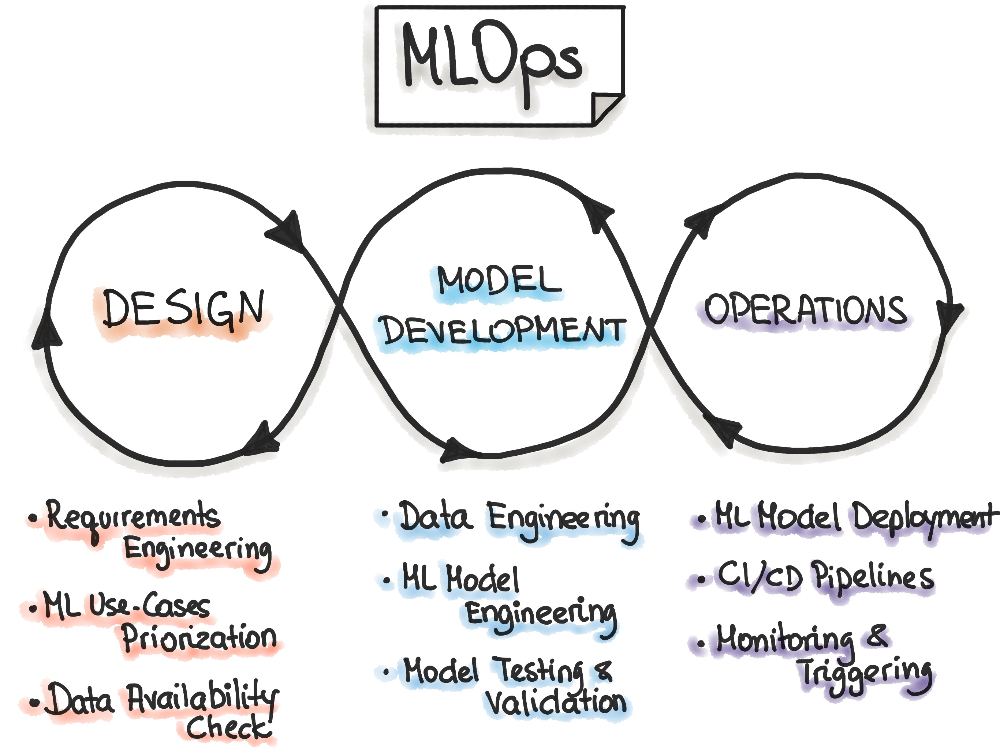
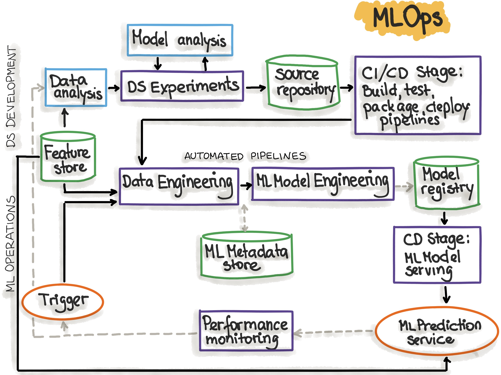

<!-- _class: lead -->
<!-- _paginate: false -->
<!-- _header: '' -->
<!-- _footer: '' -->

# Model Experimentation & Tracking in MLOps

## Dari "notebook yang berantakan" menuju eksperimen yang *reproducible*, terukur, dan siap produksi

**Machine Learning Operations (MLOps)** — Minggu 6
Ahmad Luky Ramdani · Program Studi Sains Data · ITERA

---

# Capaian Pembelajaran

Setelah sesi ini, mahasiswa mampu:

1. **Menjelaskan** mengapa eksperimen ML bersifat iteratif dan mengapa *experiment tracking* adalah prinsip inti MLOps.
2. **Mengidentifikasi** komponen yang wajib dilacak: *code, data, hyperparameter, environment, metrics, artifacts*.
3. **Merancang** eksperimen deep learning yang valid (baseline, kontrol variabel, *seed*, *ablation*).
4. **Menerapkan** *model versioning* dan *model registry*.
5. **Menggunakan** tools (MLflow, W&B, DVC, dll.) untuk mencatat, membandingkan, dan mempromosikan model.

---

# Agenda

| # | Topik |
|---|-------|
| 1 | Motivasi: ML adalah ilmu eksperimental |
| 2 | Posisi experiment tracking dalam prinsip MLOps |
| 3 | Anatomi eksperimen: *experiment, run, params, metrics, artifacts* |
| 4 | **Experimentation in Deep Learning** — desain eksperimen yang benar |
| 5 | **Tracking Metrics** — apa, kapan, dan bagaimana |
| 6 | **Model Versioning** — data, kode, model, registry |
| 7 | **Tools for Experiment Tracking** — lanskap & perbandingan |
| 8 | Hands-on MLflow + integrasi ke pipeline CI/CD/CT |
| 9 | **Hands-on 2**: studi kasus end-to-end MLflow + scikit-learn |
| 10 | Best practices, anti-pattern, dan ringkasan |

---

<!-- _class: divider -->

# 1. Motivasi

Mengapa kita butuh *experiment tracking*?

---

# ML Itu Eksperimental, Bukan Deterministik

Software tradisional: **requirement → kode → hasil yang dapat diprediksi**.
Machine learning: **hipotesis → eksperimen → evaluasi → ulangi** (puluhan hingga ribuan kali).

Satu proyek deep learning biasa melibatkan variasi pada:

- **Arsitektur**: ResNet-18 vs ResNet-50 vs ViT, jumlah layer, dropout
- **Hyperparameter**: learning rate, batch size, optimizer, scheduler, weight decay
- **Data**: versi dataset, split, augmentasi, preprocessing, sampling
- **Environment**: versi library, CUDA, GPU, random seed

> Dengan 5 learning rate × 3 batch size × 3 arsitektur × 2 augmentasi = **90 run**. Tanpa pencatatan sistematis, tidak mungkin diingat mana yang terbaik — apalagi *mengapa*.

---

# Gejala Tim Tanpa Experiment Tracking

- 📁 `model_final.pkl`, `model_final_v2.pkl`, `model_final_FIX_benar.pkl`
- 📓 Notebook dengan cell yang dijalankan tidak berurutan → hasil tidak bisa diulang
- 📊 Spreadsheet manual yang tidak sinkron dengan kode yang sebenarnya dijalankan
- ❓ "Akurasi 94% itu dari data versi mana? Hyperparameter-nya apa? Commit yang mana?"
- 🔁 Eksperimen yang sama diulang karena lupa sudah pernah dicoba
- 🚫 Model di produksi bermasalah, tetapi **tidak bisa ditelusuri asalnya** (*no lineage*)

> **Reproducibility crisis**: banyak hasil ML (riset maupun industri) tidak dapat direproduksi, bahkan oleh pembuatnya sendiri.

---

# The real cost of not tracking

| Masalah | Dampak |
|---------|--------|
| Hasil tidak reproducible | Tidak bisa memverifikasi klaim performa; *rework* |
| Tidak ada perbandingan objektif | Keputusan model berdasarkan "feeling" |
| Pengetahuan hilang saat anggota tim keluar | *Bus factor* = 1 |
| Tidak ada audit trail | Gagal memenuhi regulasi (mis. sektor keuangan, kesehatan, EU AI Act) |
| Eksperimen duplikat | Pemborosan GPU-hours dan biaya cloud |
| Debugging produksi sulit | Tidak tahu data/kode apa yang menghasilkan model |

---

<!-- _class: divider -->

# 2. Experiment Tracking dalam Prinsip MLOps

---

# MLOps Principles (ml-ops.org)

Prinsip inti MLOps yang saling terkait:

| Prinsip | Kaitan dengan Experiment Tracking |
|---------|-----------------------------------|
| **Iterative-Incremental Development** | Eksperimen adalah unit iterasi dalam fase *Model Development* |
| **Automation** | Logging otomatis, hyperparameter search otomatis |
| **Continuous X** (CI/CD/CT/CM) | Continuous Training menghasilkan run baru yang harus terlacak |
| **Versioning** | Versi data, kode, dan model untuk setiap run |
| **Experiments Tracking** | Prinsip eksplisit: catat setiap eksperimen beserta konteksnya |
| **Testing** | Validasi model dan data sebelum dipromosikan |
| **Monitoring** | Bandingkan metrik produksi dengan metrik eksperimen |
| **Reproducibility** | Tujuan akhir: hasil identik dari input identik |

---

# MLOps Principles (ml-ops.org)
<br/>
<center>

</center>

---

# MLOps Principles (ml-ops.org)
<br/>
<center>

</center>

---

# Tiga Fase MLOps & Posisi Eksperimen

```
 ┌───────────────────┐    ┌─────────────────────────────┐    ┌───────────────────────┐
 │  1. DESIGN        │    │  2. MODEL DEVELOPMENT       │    │  3. OPERATIONS        │
 │                   │    │   (Experimentation)         │    │                       │
 │ • Requirement     │──▶ │ • Data engineering          │──▶ │ • CI/CD pipeline      │
 │ • Use-case        │    │ • ML model engineering      │    │ • Serving / Deploy    │
 │ • Data available? │    │ • Model testing & validasi  │    │ • Monitoring          │
 │                   │    │ ★ EXPERIMENT TRACKING ★    │    │ • Triggering retrain  │
 └───────────────────┘    └─────────────────────────────┘    └───────────────────────┘
          ▲                              │                               │
          └──────────── feedback loop ◀──┴──────── drift / degradasi ◀──┘
```

Experiment tracking adalah **jembatan** antara *development* dan *operations*: model yang di-deploy harus dapat ditelusuri ke **run eksperimen** yang menghasilkannya.

---

# Mengapa ML Butuh Lebih dari Git?

Software tradisional: **Code** → versi cukup dengan Git.
Machine learning: **Code + Data + Model + Config + Environment**.

```
           Software 1.0                    Software 2.0 (ML)
      ┌──────────────────┐          ┌──────────────────────────────┐
      │      CODE        │          │  CODE   ─┐                   │
      │        │         │          │  DATA   ─┼──▶ TRAINING ──▶ MODEL
      │        ▼         │          │  PARAMS ─┤     (stokastik)   │
      │    PROGRAM       │          │  ENV    ─┘                   │
      └──────────────────┘          └──────────────────────────────┘
       versi: git commit             versi: git + data hash + run id
                                            + model version
```

> Model adalah **fungsi dari data**. Mengubah satu baris data dapat mengubah model, meskipun kode tidak berubah sama sekali.

---

<!-- _class: divider -->

# 3. Anatomi Eksperimen

Istilah dan konsep dasar

---

# Terminologi Kunci

| Istilah | Definisi | Contoh |
|---------|----------|--------|
| **Experiment** | Kumpulan run untuk satu pertanyaan/tujuan | `churn-prediction`, `cifar10-classifier` |
| **Run** | Satu kali eksekusi kode training | `run_id = a3f9c1…` |
| **Parameters** | Input konfigurasi (statis per run) | `lr=0.001`, `batch_size=64` |
| **Metrics** | Hasil terukur, bisa per *step/epoch* | `val_loss`, `f1`, `auc` |
| **Artifacts** | File keluaran | model `.pt`, confusion matrix, plot, log |
| **Tags / Metadata** | Label bebas untuk pencarian | `author`, `git_commit`, `stage=baseline` |
| **Lineage** | Jejak asal-usul model | data v3 + commit `9e1b` → run X → model v7 |

---

# Apa yang Harus Dilacak? (The "Full Context")

| Kategori | Item | Mengapa penting |
|----------|------|-----------------|
| **Code** | Git commit hash, branch, *diff* yang belum di-commit | Kode yang tepat yang dijalankan |
| **Data** | Versi/hash dataset, split, skema, statistik | Model = f(data) |
| **Hyperparameters** | lr, epochs, optimizer, arsitektur, seed | Menjelaskan perbedaan hasil |
| **Environment** | `requirements.txt`, Docker image, versi CUDA/cuDNN | Library berbeda → hasil berbeda |
| **Metrics** | Training & validation curves, metrik test akhir | Dasar perbandingan |
| **Artifacts** | Bobot model, plot, prediksi, *feature importance* | Bukti & deliverable |
| **System** | GPU/CPU, memori, durasi, biaya | Efisiensi dan kapasitas |
| **Context** | Siapa, kapan, hipotesis, catatan | Pengetahuan tim |

---

# Siklus Sebuah Eksperimen

```
   ┌────────────┐   ┌────────────┐   ┌────────────┐   ┌────────────┐   ┌────────────┐
   │ 1.HIPOTESIS│──▶│ 2. DESAIN  │──▶│ 3. EKSEKUSI│──▶│ 4. ANALISIS│──▶│ 5. KEPUTUSAN│
   │            │   │            │   │  + LOGGING │   │ & KOMPARASI│   │            │
   │"Augmentasi │   │ baseline,  │   │ params,    │   │ kurva,     │   │ promote /  │
   │ mixup naik │   │ variabel,  │   │ metrics,   │   │ tabel,     │   │ iterate /  │
   │ F1 ≥ 2%"   │   │ metrik,    │   │ artifacts  │   │ uji        │   │ discard    │
   │            │   │ seed       │   │            │   │ signifikan │   │            │
   └────────────┘   └────────────┘   └────────────┘   └────────────┘   └─────┬──────┘
         ▲                                                                   │
         └────────────────────────── insight baru ───────────────────────────┘
```

> Eksperimen yang baik dimulai dari **hipotesis yang dapat diuji**, bukan dari "coba-coba saja".

---

<!-- _class: divider -->

# 4. Experimentation in Deep Learning

Merancang eksperimen yang valid

---

# Prinsip Desain Eksperimen

1. **Mulai dari baseline** — model sederhana (mis. logistic regression, ResNet-18 pretrained) sebagai titik acuan.
2. **Ubah satu hal pada satu waktu** — agar efek dapat diatribusikan (*controlled experiment*).
3. **Tetapkan metrik utama sebelum mulai** — hindari *metric shopping* setelah melihat hasil.
4. **Kunci data split** — train / validation / test tetap dan berversi; **test set hanya disentuh di akhir**.
5. **Kendalikan keacakan** — set seed; jalankan beberapa seed untuk mengukur variansi.
6. **Catat hipotesis & kesimpulan** — termasuk eksperimen yang **gagal** (negative results juga pengetahuan).

---

# Sumber Non-Determinisme di Deep Learning

| Sumber | Contoh | Mitigasi |
|--------|--------|----------|
| Inisialisasi bobot | Random init | `torch.manual_seed(42)` |
| Data shuffling | `DataLoader(shuffle=True)` | Seed + `worker_init_fn`, `generator` |
| Augmentasi acak | RandomCrop, Mixup | Seed pada library augmentasi |
| Dropout | Mask acak | Seed global |
| Operasi GPU | cuDNN autotune, atomic add | `torch.backends.cudnn.deterministic=True`, `torch.use_deterministic_algorithms(True)` |
| Hardware/library | Versi CUDA berbeda | Lock environment (Docker) |

```python
import random, numpy as np, torch
def set_seed(seed: int = 42):
    random.seed(seed); np.random.seed(seed)
    torch.manual_seed(seed); torch.cuda.manual_seed_all(seed)
    torch.backends.cudnn.deterministic = True
    torch.backends.cudnn.benchmark = False
```

---

# Variansi: Satu Run Tidak Cukup

Dua konfigurasi, masing-masing 5 seed:

| Konfigurasi | Seed 1 | Seed 2 | Seed 3 | Seed 4 | Seed 5 | **Mean ± Std** |
|-------------|--------|--------|--------|--------|--------|----------------|
| A (lr=1e-3) | 91.2 | 90.4 | 92.0 | 90.8 | 91.5 | **91.18 ± 0.61** |
| B (lr=3e-4) | 92.1 | 89.7 | 91.0 | 92.4 | 90.3 | **91.10 ± 1.15** |

- Jika hanya melihat seed 4 → "B lebih baik". Ternyata **tidak berbeda signifikan**.
- Laporkan **mean ± std** atau *confidence interval*; gunakan uji statistik (t-test, bootstrap) untuk klaim perbaikan.
- Experiment tracker memudahkan agregasi ini dengan **tag/grouping** per konfigurasi.

---

# Strategi Hyperparameter Search

| Strategi | Cara kerja | Kelebihan | Kekurangan |
|----------|-----------|-----------|------------|
| **Manual** | Intuisi peneliti | Murah untuk awal | Bias, tidak sistematis |
| **Grid Search** | Semua kombinasi | Lengkap, sederhana | Eksponensial (*curse of dimensionality*) |
| **Random Search** | Sampel acak | Lebih efisien dari grid (Bergstra & Bengio, 2012) | Tidak belajar dari run sebelumnya |
| **Bayesian Opt.** (Optuna/TPE) | Model surrogate memilih titik berikutnya | Efisien sampel | Lebih kompleks |
| **Early-stopping based** (Hyperband/ASHA) | Hentikan run yang jelek lebih awal | Hemat komputasi | Butuh metrik intermediate |

> Setiap trial = **satu run** di tracker. Gunakan **nested runs** (parent = sweep, child = trial) agar terorganisir.

---

# Ablation Study

Tujuan: mengukur **kontribusi tiap komponen** dengan menghapusnya satu per satu.

| Run | Pretrained | Augmentasi | Label Smoothing | Scheduler | Val F1 |
|-----|:---------:|:----------:|:---------------:|:---------:|-------:|
| Full model | ✅ | ✅ | ✅ | ✅ | **0.884** |
| − Pretrained | ❌ | ✅ | ✅ | ✅ | 0.802 |
| − Augmentasi | ✅ | ❌ | ✅ | ✅ | 0.851 |
| − Label smoothing | ✅ | ✅ | ❌ | ✅ | 0.879 |
| − Scheduler | ✅ | ✅ | ✅ | ❌ | 0.866 |

**Insight**: pretrained weights paling berpengaruh (−8.2 poin); label smoothing hampir tidak berpengaruh → kandidat untuk disederhanakan.

> Tanpa tracker, tabel seperti ini harus dirakit manual dari log yang tercecer.

---

<!-- _class: divider -->

# 5. Tracking Metrics

Apa, kapan, dan bagaimana mengukur

---

# Jenis Metrik yang Dilacak

| Level | Contoh metrik | Granularitas |
|-------|---------------|--------------|
| **Training dynamics** | train/val loss, accuracy, learning rate, gradient norm | per step / epoch |
| **Model quality (offline)** | Accuracy, Precision, Recall, F1, ROC-AUC, RMSE, mAP, BLEU | per run (akhir) |
| **Per-segment / fairness** | F1 per kelas, per wilayah, per gender | per run |
| **Efisiensi** | Waktu training, latency inferensi, ukuran model, FLOPs | per run |
| **System** | GPU utilization, memori GPU, throughput (samples/s) | time-series |
| **Business (online)** | CTR, konversi, revenue — via A/B test | produksi |

> **Offline metric ≠ online metric.** Model dengan AUC tertinggi belum tentu memberi dampak bisnis terbesar; tracking harus menghubungkan keduanya.

---

# Membaca Learning Curves

```
 loss                                     loss
  │╲                                       │╲
  │ ╲   val                                │ ╲        ╱‾‾ val  ← divergen
  │  ╲___________                          │  ╲______╱
  │   ╲__________ train                    │   ╲________________ train
  │                                        │
  └──────────────────▶ epoch               └──────────────────▶ epoch
     ✅ Good fit                               ⚠️ Overfitting → early stopping /
                                                  regularisasi / data lebih banyak

 loss                                     loss
  │‾‾‾‾‾‾‾‾‾‾‾‾‾ val                       │ ╱╲  ╱╲ ╱╲
  │‾‾‾‾‾‾‾‾‾‾‾‾ train                      │╱  ╲╱  ╲╱  ╲╱  ← osilasi
  │                                        │
  └──────────────────▶ epoch               └──────────────────▶ epoch
     ⚠️ Underfitting → model lebih besar,      ⚠️ LR terlalu besar → turunkan lr,
        training lebih lama                       gunakan scheduler / warmup
```

Logging **per step** (bukan hanya nilai akhir) memungkinkan diagnosis seperti ini.

---

# Memilih Metrik yang Tepat

- **Satu metrik utama (*optimizing metric*)** untuk menentukan "terbaik", mis. `val_f1_macro`.
- **Metrik pembatas (*satisficing metrics*)** sebagai syarat minimum, mis. `latency_p95 < 100 ms`, `model_size < 50 MB`.
- Sesuaikan dengan masalah:
  - Data **imbalanced** → F1, PR-AUC, *balanced accuracy* (bukan accuracy).
  - Biaya FN ≫ FP (deteksi penyakit) → **Recall** / *sensitivity*.
  - Ranking/rekomendasi → NDCG, MAP@k.
- Selalu log **metrik pada data validasi**, dan metrik **test** hanya untuk kandidat final.

> "Kebocoran" test set via pemilihan model berulang = *overfitting to the test set*.

---

# Pitfalls dalam Tracking Metrics

| Pitfall | Contoh | Solusi |
|---------|--------|--------|
| **Data leakage** | Normalisasi dihitung pada seluruh data sebelum split | Fit preprocessing hanya pada train; log pipeline sebagai artifact |
| **Cherry-picking** | Melaporkan seed/epoch terbaik saja | Log semua run; laporkan mean ± std |
| **Metrik tidak konsisten** | `f1` macro di run A, weighted di run B | Nama metrik eksplisit: `val_f1_macro` |
| **Split berbeda** | Random split ulang di tiap run | Version & hash data split |
| **Hanya log nilai akhir** | Tidak tahu kapan overfitting mulai | Log per step/epoch |
| **Lupa metrik sistem** | Model akurat tapi 10× lebih lambat | Log latency & resource |

---

<!-- _class: divider -->

# 6. Model Versioning

Data · Code · Model · Registry

---

# Tiga Pilar Versioning

| Pilar | Tools | Yang di-versi |
|-------|-------|---------------|
| **Code** | Git, GitHub/GitLab | Script training, preprocessing, konfigurasi |
| **Data** | DVC, LakeFS, Delta Lake, Pachyderm | Dataset mentah, fitur, split |
| **Model** | MLflow Model Registry, W&B Artifacts, DVC | Bobot, signature, metadata, stage |

**Run eksperimen** adalah simpul yang mengikat ketiganya:

```
  git commit 9e1b2c  ─┐
  data  md5:7fa3…    ─┼──▶  run_id a3f9c1  ──▶  model "fraud-detector" v7  ──▶  production
  config.yaml        ─┘      (metrics, artifacts, env)
```

> Dengan *lineage* ini, setiap prediksi di produksi dapat ditelusuri kembali ke data dan kode asalnya.

---

# Data Versioning dengan DVC

DVC menyimpan **pointer kecil** (`.dvc` file berisi hash) di Git; data aslinya di remote storage (S3, GCS, GDrive, dsb).

```bash
git init && dvc init
dvc remote add -d storage s3://my-bucket/dvc-store

dvc add data/train.csv              # buat data/train.csv.dvc (berisi md5 hash)
git add data/train.csv.dvc .gitignore
git commit -m "data: train v1"
dvc push                            # upload data ke remote

# ... data diperbarui ...
dvc add data/train.csv && git commit -am "data: train v2" && dvc push

git checkout <commit_v1> && dvc checkout   # kembali ke data v1 secara persis
```

Log hash data ke experiment tracker: `mlflow.log_param("data_md5", md5)` → setiap run terhubung ke versi data.

---

# Model Versioning & Model Registry

**Model Registry** = repositori terpusat untuk model dengan versi, metadata, dan status siklus hidup.

| Konsep | Penjelasan |
|--------|------------|
| **Registered model** | Nama logis, mis. `fraud-detector` |
| **Version** | Bertambah otomatis: v1, v2, v3 … — tiap versi menunjuk ke satu run |
| **Alias** (MLflow ≥ 2.9) | Pointer yang dapat dipindah: `@champion`, `@challenger` |
| **Stage** (legacy) | `None → Staging → Production → Archived` |
| **Signature** | Skema input/output model |
| **Lineage** | Run, dataset, commit, author |

```
 v5 (Archived)   v6  ◀── @champion (melayani produksi)
                 v7  ◀── @challenger (shadow / A-B test)
                 v8  (baru diregistrasi, menunggu validasi)
```

**Rollback** = memindahkan alias `@champion` kembali ke versi sebelumnya — cepat dan aman.

---

# Semantic Versioning untuk Model (Opsional)

Konvensi yang sering dipakai tim:

| Perubahan | Contoh | Versi |
|-----------|--------|-------|
| **MAJOR** — skema input/output berubah (breaking) | Tambah fitur wajib baru | `2.0.0` |
| **MINOR** — retrain dengan data/arsitektur baru, API sama | Retrain bulanan, ganti backbone | `1.3.0` |
| **PATCH** — perbaikan kecil tanpa perubahan perilaku berarti | Ubah threshold, fix preprocessing bug | `1.3.1` |

Simpan versi semantik sebagai **tag** di registry, berdampingan dengan versi numerik otomatis.

---

# Tingkat Reproducibility

| Level | Yang dijamin | Kebutuhan |
|-------|--------------|-----------|
| **L0 — Tidak ada** | "Works on my machine" | — |
| **L1 — Code** | Kode yang sama | Git commit |
| **L2 — Code + Config** | Hyperparameter sama | Tracker (params) |
| **L3 — + Data** | Data identik | DVC / data hash |
| **L4 — + Environment** | Library & OS identik | Docker / conda lock |
| **L5 — Bit-exact** | Hasil numerik identik | Seed + deterministic ops + hardware sama |

> Target realistis kebanyakan tim: **L4**, dengan L5 untuk kebutuhan audit tertentu.

---

<!-- _class: divider -->

# 7. Tools for Experiment Tracking

---

# Evolusi Cara Tracking

| Generasi | Cara | Masalah |
|----------|------|---------|
| **1. Manual** | Catatan kertas, nama file, spreadsheet | Error-prone, tidak scalable, tidak sinkron dengan kode |
| **2. Logging lokal** | `print`, CSV, TensorBoard per folder | Sulit dibandingkan lintas run & lintas orang |
| **3. Experiment tracker** | MLflow, W&B, Neptune, Comet | Terpusat, dapat di-query, visual, kolaboratif |
| **4. Platform terintegrasi** | Tracker + registry + pipeline + monitoring (Vertex AI, SageMaker, Databricks, Snowflake ML) | Lebih kompleks, potensi *vendor lock-in* |

---

<!-- _class: small -->

# Lanskap Tools

| Tool | Lisensi / Hosting | Kekuatan | Catatan |
|------|-------------------|----------|---------|
| **MLflow** | Open source (Apache 2.0), self-host / managed | Tracking + Models + Registry; framework-agnostic; de facto standar | UI lebih sederhana |
| **Weights & Biases** | SaaS (free tier akademik), self-host enterprise | Visualisasi kaya, Sweeps, Reports, kolaborasi | Data di cloud vendor |
| **Neptune.ai** | SaaS | Metadata store fleksibel, skala besar | Komersial |
| **Comet ML** | SaaS / on-prem | Experiment + production monitoring | Komersial |
| **ClearML** | Open source + SaaS | Tracking + orchestration + data mgmt | Setup lebih berat |
| **DVC / DVC Experiments** | Open source | Git-native, versioning data & eksperimen | Visualisasi via VS Code / Studio |
| **TensorBoard** | Open source | Visualisasi training DL | Bukan tracker lengkap; tanpa registry |
| **Aim** | Open source | Ringan, UI cepat untuk banyak run | Ekosistem lebih kecil |

---

# Kriteria Memilih Tool

1. **Integrasi framework** — PyTorch, TensorFlow/Keras, scikit-learn, XGBoost, HuggingFace?
2. **Hosting & data governance** — boleh data/metadata keluar dari infrastruktur sendiri?
3. **Skalabilitas** — ribuan run, metrik per step, artifact besar?
4. **Kolaborasi** — multi-user, akses kontrol, reports/dashboard?
5. **Model registry & deployment** — terhubung ke CI/CD dan serving?
6. **Biaya & lisensi** — open source vs SaaS per-seat.
7. **API & query** — bisa mencari run secara programatik (mis. "run dengan F1 > 0.9")?

> Untuk perkuliahan & tim kecil: **MLflow (self-host)** atau **W&B (free academic)** adalah titik awal yang baik.

---

<!-- _class: divider -->

# 8. Hands-on 1: MLflow

---

# Komponen MLflow

| Komponen | Fungsi |
|----------|--------|
| **MLflow Tracking** | API & UI untuk log params, metrics, artifacts, tags per run |
| **MLflow Models** | Format standar pengemasan model (*flavors*: sklearn, pytorch, keras, pyfunc…) + signature |
| **MLflow Model Registry** | Versi, alias, anotasi, dan lineage model |
| **MLflow Projects** | Pengemasan kode agar dapat dijalankan ulang (`MLproject` + env) |
| **Evaluation & GenAI** | `mlflow.evaluate`, tracing untuk LLM (versi terbaru) |

---

# Arsitektur MLflow Tracking Server

```
  ┌──────────────┐  log params/metrics   ┌─────────────────────────┐
  │ Data Scientist│ ───────────────────▶ │   MLflow Tracking Server│
  │ (notebook /   │                      │   (REST API + UI :5000) │
  │  script / CI) │ ◀─────────────────── │                         │
  └──────────────┘   query / compare     └───────┬─────────┬───────┘
                                                 │         │
                              metadata (runs,    │         │ files (model, plot,
                              params, metrics)   ▼         ▼  checkpoint)
                                     ┌────────────────┐ ┌──────────────────┐
                                     │ Backend Store  │ │ Artifact Store   │
                                     │ SQLite/Postgres│ │ local/S3/GCS/MinIO│
                                     │ /MySQL         │ │                  │
                                     └────────────────┘ └──────────────────┘
```

```bash
pip install mlflow
mlflow server --backend-store-uri sqlite:///mlflow.db \
              --default-artifact-root ./mlartifacts --host 0.0.0.0 --port 5000
```

---

# Logging Dasar

```python
import mlflow
from sklearn.datasets import load_breast_cancer
from sklearn.model_selection import train_test_split
from sklearn.ensemble import RandomForestClassifier
from sklearn.metrics import f1_score, roc_auc_score

mlflow.set_tracking_uri("http://localhost:5000")
mlflow.set_experiment("breast-cancer-clf")

X, y = load_breast_cancer(return_X_y=True)
X_tr, X_val, y_tr, y_val = train_test_split(X, y, test_size=0.2, random_state=42, stratify=y)

params = {"n_estimators": 200, "max_depth": 8, "random_state": 42}
```

---

# Logging Dasar
```python

with mlflow.start_run(run_name="rf-baseline"):
    mlflow.set_tags({"stage": "baseline", "author": "luky"})
    mlflow.log_params(params)

    model = RandomForestClassifier(**params).fit(X_tr, y_tr)
    proba = model.predict_proba(X_val)[:, 1]

    mlflow.log_metric("val_f1", f1_score(y_val, proba > 0.5))
    mlflow.log_metric("val_auc", roc_auc_score(y_val, proba))
    mlflow.sklearn.log_model(model, name="model", input_example=X_val[:5],
                             skops_trusted_types=["sklearn.tree._tree.Tree"])  # RF (MLflow 3)
```


---

# Deep Learning: Logging per Epoch (PyTorch)

```python
import mlflow, torch

cfg = {"lr": 3e-4, "batch_size": 64, "epochs": 20, "arch": "resnet18", "seed": 42}
set_seed(cfg["seed"])

with mlflow.start_run(run_name=f"{cfg['arch']}-lr{cfg['lr']}"):
    mlflow.log_params(cfg)
    mlflow.log_param("data_md5", dataset_md5)            # tautkan ke versi data
    mlflow.log_artifact("requirements.txt")              # environment

    best_f1 = 0.0
    for epoch in range(cfg["epochs"]):
        train_loss = train_one_epoch(model, train_loader, optimizer)
        val_loss, val_f1 = evaluate(model, val_loader)

        mlflow.log_metrics({"train_loss": train_loss, "val_loss": val_loss,
                            "val_f1": val_f1, "lr": scheduler.get_last_lr()[0]},
                           step=epoch)

        if val_f1 > best_f1:                             # checkpoint terbaik
            best_f1 = val_f1
            torch.save(model.state_dict(), "best.pt")
            mlflow.log_artifact("best.pt", artifact_path="checkpoints")

```

---

# Deep Learning: Logging per Epoch (PyTorch)

```python
    mlflow.log_metric("best_val_f1", best_f1)
    mlflow.pytorch.log_model(model, name="model")
```
---

# Autologging

Satu baris untuk mencatat params, metrics, dan model secara otomatis:

```python
import mlflow
mlflow.autolog()            # mendeteksi library yang dipakai

# atau spesifik framework:
mlflow.sklearn.autolog()
mlflow.tensorflow.autolog()   # Keras: model.fit(...) → loss/metrics per epoch
mlflow.pytorch.autolog()      # PyTorch Lightning Trainer
mlflow.xgboost.autolog()
```

| Kelebihan | Keterbatasan |
|-----------|--------------|
| Cepat, minim kode | Tidak tahu versi data & konteks bisnis |
| Konsisten antar run | Metrik custom tetap perlu di-log manual |
| Menyimpan model + signature | Bisa mencatat terlalu banyak (noise) |

> Praktik terbaik: **autolog + log manual** untuk data version, git commit, dan metrik domain.

---

# Hyperparameter Tuning dengan Nested Runs (Optuna + MLflow)

```python
import mlflow, optuna

def objective(trial):
    params = {
        "lr": trial.suggest_float("lr", 1e-5, 1e-2, log=True),
        "batch_size": trial.suggest_categorical("batch_size", [32, 64, 128]),
        "dropout": trial.suggest_float("dropout", 0.0, 0.5),
    }
    with mlflow.start_run(run_name=f"trial-{trial.number}", nested=True):
        mlflow.log_params(params)
        val_f1 = train_and_eval(params)
        mlflow.log_metric("val_f1", val_f1)
    return val_f1
```


---

# Hyperparameter Tuning dengan Nested Runs (Optuna + MLflow)

```python

with mlflow.start_run(run_name="optuna-sweep-01"):              # parent run
    study = optuna.create_study(direction="maximize")
    study.optimize(objective, n_trials=50)
    mlflow.log_params({f"best_{k}": v for k, v in study.best_params.items()})
    mlflow.log_metric("best_val_f1", study.best_value)
```
UI menampilkan **parent run** dengan 50 **child runs** yang dapat dibandingkan (parallel coordinates plot).


---

# Membandingkan & Mencari Run secara Programatik

```python
import mlflow

runs = mlflow.search_runs(
    experiment_names=["breast-cancer-clf"],
    filter_string="metrics.val_f1 > 0.95 and params.max_depth = '8' and tags.stage != 'debug'",
    order_by=["metrics.val_f1 DESC"],
    max_results=10,
)
print(runs[["run_id", "params.n_estimators", "metrics.val_f1", "metrics.val_auc"]])

best_run_id = runs.iloc[0]["run_id"]
```

Di **MLflow UI** (`http://localhost:5000`):
- Pilih beberapa run → **Compare** → *parallel coordinates*, *scatter*, *contour plot*
- Overlay **learning curves** antar run
- Lihat **artifacts** (model, plot) dan **diff parameter**

---

# Model Registry: Register → Alias → Load

```python
import mlflow
from mlflow import MlflowClient

client = MlflowClient()
name = "breast-cancer-clf"

# 1. Registrasi model dari run terbaik
mv = mlflow.register_model(f"runs:/{best_run_id}/model", name)

# 2. Anotasi & tandai sebagai challenger
client.update_model_version(name, mv.version, description="RF depth=8, data v3")
client.set_model_version_tag(name, mv.version, "validation_status", "passed")
client.set_registered_model_alias(name, "challenger", mv.version)

# 3. Setelah lolos validasi / A-B test → promosikan
client.set_registered_model_alias(name, "champion", mv.version)

# 4. Aplikasi serving selalu memuat via alias (tanpa hard-code versi)
model = mlflow.pyfunc.load_model(f"models:/{name}@champion")
preds = model.predict(X_new)
```

```bash
mlflow models serve -m "models:/breast-cancer-clf@champion" -p 8080   # REST endpoint
```

---

# Integrasi ke Pipeline CI/CD/CT

```
 ┌─────────┐   ┌──────────────┐   ┌────────────┐   ┌──────────────┐   ┌────────────┐
 │ git push│──▶│ CI: test kode│──▶│ Training   │──▶│ Validasi     │──▶│ Registry   │
 │ / data  │   │ + data check │   │ pipeline   │   │ otomatis     │   │ @challenger│
 │ baru    │   │              │   │ (log ke    │   │ new ≥ champ? │   │            │
 └─────────┘   └──────────────┘   │  MLflow)   │   │ fairness ok? │   └─────┬──────┘
                                  └────────────┘   └──────────────┘         │
      ▲                                                                     ▼
      │      ┌────────────────┐      ┌───────────────────┐       ┌────────────────┐
      └──────│ Monitoring:    │◀─────│ Serving           │◀──────│ CD: promote ke │
   retrain   │ drift, kinerja │      │ models:/x@champion│       │ @champion      │
   trigger   └────────────────┘      └───────────────────┘       └────────────────┘
```

- **Quality gate**: model baru hanya dipromosikan jika metrik ≥ champion (+ margin) pada data uji yang sama.
- Setiap retraining otomatis (**Continuous Training**) menghasilkan run yang **terlacak penuh**.

---

# Tingkat Kematangan MLOps & Tracking

| Level (Google MLOps) | Karakteristik | Peran Experiment Tracking |
|----------------------|---------------|---------------------------|
| **Level 0 — Manual** | Notebook, deploy manual, retrain jarang | Sering tidak ada / spreadsheet |
| **Level 1 — ML Pipeline Automation** | Pipeline training otomatis, Continuous Training | Tracker + registry wajib; metadata pipeline tercatat |
| **Level 2 — CI/CD Pipeline Automation** | Pipeline itu sendiri di-test & di-deploy otomatis | Tracking terintegrasi penuh dengan CI/CD, monitoring, dan governance |

> Experiment tracking adalah **langkah pertama** yang paling murah dan berdampak besar untuk naik dari Level 0.

---

<!-- _class: divider -->

# 9. Hands-on 2: Studi Kasus End-to-End

MLflow + scikit-learn — dari hipotesis hingga model di produksi

---

# Skenario: Deteksi Tumor Ganas (Breast Cancer Wisconsin)

**Masalah bisnis**: membantu dokter memprioritaskan pemeriksaan lanjutan untuk tumor yang kemungkinan **ganas (malignant)**.

| Aspek | Keputusan (ditetapkan **sebelum** eksperimen) |
|-------|-----------------------------------------------|
| Dataset | `sklearn.datasets.load_breast_cancer` — 569 sampel, 30 fitur numerik |
| Kelas positif | `1 = malignant` (label asli dibalik: `1 - target`) |
| **Optimizing metric** | **Recall** — *false negative* (tumor ganas terlewat) sangat mahal |
| **Satisficing metric** | Precision ≥ **0.90** — agar tidak membanjiri dokter dengan alarm palsu |
| Protokol evaluasi | Train 80% (5-fold Stratified CV untuk seleksi) · Test 20% (**hanya sekali** di akhir) |
| Algoritma | Sederhana: Dummy, Logistic Regression, KNN, Decision Tree, Random Forest, SVC, Gradient Boosting |

---

# Skenario: Deteksi Tumor Ganas (Breast Cancer Wisconsin)

**Hipotesis**
- **H1**: Model linear sederhana sudah jauh lebih baik dari baseline *dummy*.
- **H2**: Standardisasi fitur meningkatkan recall model berbasis jarak/margin (LR, KNN, SVC).
- **H3**: Tuning hyperparameter SVC meningkatkan recall tanpa melanggar precision ≥ 0.90.

---

# Alur Eksperimen yang Akan Dibangun

```
 ┌──────────────┐  ┌──────────────┐  ┌──────────────┐  ┌──────────────┐  ┌──────────────┐
 │ L1. Data     │─▶│ L2. Baseline │─▶│ L3. Model    │─▶│ L4. Tuning   │─▶│ L5. Analisis │
 │ split + hash │  │ Dummy, LR    │  │ selection    │  │ GridSearchCV │  │ search_runs  │
 │ log_input    │  │ (±scaling)   │  │ 5 algoritma  │  │ nested runs  │  │ + UI compare │
 └──────────────┘  └──────────────┘  └──────────────┘  └──────────────┘  └──────┬───────┘
                                                                                │
 ┌──────────────┐  ┌──────────────┐  ┌──────────────┐  ┌──────────────┐         │
 │ L9. Reproduce│◀─│ L8. Serving  │◀─│ L7. Registry │◀─│ L6. Evaluasi │◀────────┘
 │ dari run_id  │  │ REST API     │  │ quality gate │  │ test set     │
 │              │  │ @champion    │  │ @challenger  │  │ (sekali)     │
 └──────────────┘  └──────────────┘  └──────────────┘  └──────────────┘
```

Semua langkah mencatat ke **satu experiment** MLflow: `bc-malignant-detection`.

---

# Struktur Proyek & Setup

```
bc-mlops/
├── data/                  # train.csv, test.csv  (di-versi dengan DVC)
├── src/
│   ├── data.py            # L1: load, split, hash
│   ├── tracking.py        # run_experiment(): fungsi logging standar
│   ├── train.py           # L2–L4: baseline, model selection, tuning
│   ├── evaluate.py        # L6: evaluasi final di test set
│   └── register.py        # L7: registry + quality gate
├── requirements.txt       # mlflow, scikit-learn, pandas, matplotlib
└── .gitignore             # mlflow.db, mlartifacts/
```

---

# Struktur Proyek & Setup

```bash
python -m venv .venv && source .venv/bin/activate
pip install "mlflow>=3" scikit-learn pandas matplotlib requests   # diuji: MLflow 3.17
pip freeze > requirements.txt                     # kunci environment

# Terminal 1: tracking server (metadata → SQLite, file → folder lokal)
mlflow server --backend-store-uri sqlite:///mlflow.db \
              --default-artifact-root ./mlartifacts --port 5000

# Terminal 2: semua script akan membaca variabel ini
export MLFLOW_TRACKING_URI=http://127.0.0.1:5000
```

---

# L1 — Data: Split Tetap + Versi Data (Hash)

```python
import hashlib, mlflow, pandas as pd
from sklearn.datasets import load_breast_cancer
from sklearn.model_selection import train_test_split

mlflow.set_experiment("bc-malignant-detection")

df = load_breast_cancer(as_frame=True).frame
df["target"] = 1 - df["target"]                       # 1 = malignant (kelas positif)

# Sidik jari data: berubah satu nilai pun → hash berbeda
data_md5 = hashlib.md5(pd.util.hash_pandas_object(df, index=True).values).hexdigest()

train_df, test_df = train_test_split(df, test_size=0.2, stratify=df["target"], random_state=42)
train_df.to_csv("data/train.csv", index=False)
test_df.to_csv("data/test.csv", index=False)          # test set: DIKUNCI sampai L6
```
---

# L1 — Data: Split Tetap + Versi Data (Hash)

```python
X_train, y_train = train_df.drop(columns="target"), train_df["target"]
X_test,  y_test  = test_df.drop(columns="target"),  test_df["target"]

# Objek Dataset MLflow → tampil di tab "Datasets" pada setiap run
train_ds = mlflow.data.from_pandas(train_df, source="data/train.csv",
                                   name="bc-train", targets="target")
COMMON_TAGS = {"data_md5": data_md5, "split_seed": "42", "dataset": "sklearn-breast-cancer"}
```

> **Prinsip**: *Versioning* & *Reproducibility* — setiap run tahu persis data apa yang dipakai.

---

# Fungsi Logging Standar `run_experiment()` (1/2)

Satu fungsi dipakai **semua** eksperimen → nama metrik & artefak konsisten, mudah dibandingkan.

```python
import mlflow, matplotlib.pyplot as plt
from sklearn.model_selection import StratifiedKFold, cross_validate, cross_val_predict
from sklearn.metrics import ConfusionMatrixDisplay, classification_report
from mlflow.models import infer_signature

CV = StratifiedKFold(n_splits=5, shuffle=True, random_state=42)   # fold identik utk semua run
SCORING = ["recall", "precision", "f1", "roc_auc"]

def run_experiment(run_name, pipe, tags=None, note=""):
    with mlflow.start_run(run_name=run_name) as run:
        # (a) KONTEKS: tag, catatan hipotesis, versi data
        mlflow.set_tags({**COMMON_TAGS, "candidate": "true", **(tags or {})})
        mlflow.set_tag("mlflow.note.content", note)        # deskripsi run di UI
        mlflow.log_input(train_ds, context="training")
```

---

# Fungsi Logging Standar `run_experiment()` (2/2)

```python
        # (b) PARAMETER: langkah pipeline + seluruh hyperparameter estimator
        mlflow.log_param("pipeline_steps", " -> ".join(pipe.named_steps))
        mlflow.log_params({f"clf__{k}": v for k, v in pipe[-1].get_params().items()})

        # (c) METRIK: mean & std dari 5-fold CV (bukan satu angka tunggal!)
        cv = cross_validate(pipe, X_train, y_train, cv=CV, scoring=SCORING)
        for m in SCORING:
            mlflow.log_metric(f"cv_{m}_mean", cv[f"test_{m}"].mean())
            mlflow.log_metric(f"cv_{m}_std",  cv[f"test_{m}"].std())
        mlflow.log_metric("fit_time_s", cv["fit_time"].mean())
        ...                                                 # lanjut ke slide berikut
```

---

# Fungsi Logging Standar `run_experiment()` (2/2)

```python
        # (d) ARTEFAK DIAGNOSTIK: prediksi out-of-fold (tanpa menyentuh test set)
        y_oof = cross_val_predict(pipe, X_train, y_train, cv=CV)
        disp = ConfusionMatrixDisplay.from_predictions(
            y_train, y_oof, display_labels=["benign", "malignant"])
        mlflow.log_figure(disp.figure_, "plots/confusion_matrix_oof.png")
        plt.close(disp.figure_)
        mlflow.log_text(classification_report(y_train, y_oof, zero_division=0),
                        "reports/classification_report_oof.txt")

        # (e) MODEL: dilatih ulang di seluruh train set + signature & contoh input
        pipe.fit(X_train, y_train)
        signature = infer_signature(X_train, pipe.predict(X_train))
        info = mlflow.sklearn.log_model(pipe, name="model", signature=signature,
                    input_example=X_train.head(3),
                    skops_trusted_types=["sklearn.tree._tree.Tree"])  # utk DT/RF/GB
        mlflow.set_tag("model_uri", info.model_uri)        # models:/m-… (MLflow 3)
        return run.info.run_id
```

---

# Fungsi Logging Standar `run_experiment()` (2/2)

| Yang tercatat per run | Lokasi di MLflow |
|-----------------------|------------------|
| `data_md5`, `stage`, `model_family`, catatan hipotesis | Tags / Description |
| Git commit, nama script, user | Otomatis: `mlflow.source.git.commit`, `mlflow.source.name`, `mlflow.user` |
| Dataset `bc-train` | Tab *Datasets used* |
| Hyperparameter, langkah pipeline | Parameters |
| `cv_*_mean`, `cv_*_std`, `fit_time_s` | Metrics |
| Confusion matrix, classification report, model + `requirements.txt` + `conda.yaml` | Artifacts |

---

# L2 — Baseline: Seberapa Buruk "Tanpa Model"? (H1, H2)

```python
from sklearn.pipeline import Pipeline
from sklearn.preprocessing import StandardScaler
from sklearn.dummy import DummyClassifier
from sklearn.linear_model import LogisticRegression

run_experiment("00-dummy-most-frequent",
    Pipeline([("clf", DummyClassifier(strategy="most_frequent"))]),
    tags={"stage": "baseline", "model_family": "dummy"},
    note="Batas bawah: selalu menebak kelas mayoritas (benign).")

run_experiment("01-logreg-noscale",
    Pipeline([("clf", LogisticRegression(max_iter=5000))]),
    tags={"stage": "baseline", "model_family": "logreg"},
    note="H1: model linear tanpa preprocessing.")

run_experiment("02-logreg-scaled",
    Pipeline([("scaler", StandardScaler()), ("clf", LogisticRegression(max_iter=5000))]),
    tags={"stage": "baseline", "model_family": "logreg"},
    note="H2: hanya menambah StandardScaler, variabel lain tetap.")
```

---

# L2 — Baseline: Seberapa Buruk "Tanpa Model"? (H1, H2)

- `00` → recall = **0.0**: akurasi ~63% terlihat "lumayan", padahal **tidak ada** tumor ganas yang terdeteksi → bukti mengapa *accuracy* menyesatkan.
- `01` vs `02` adalah **controlled experiment**: hanya satu variabel (scaling) yang berubah.

---

# L3 — Model Selection: Bandingkan Algoritma Sederhana

```python
from sklearn.neighbors import KNeighborsClassifier
from sklearn.tree import DecisionTreeClassifier
from sklearn.ensemble import RandomForestClassifier, GradientBoostingClassifier
from sklearn.svm import SVC

candidates = {
    "knn":  KNeighborsClassifier(n_neighbors=5),
    "tree": DecisionTreeClassifier(max_depth=5, random_state=42),
    "rf":   RandomForestClassifier(n_estimators=200, random_state=42),
    "gb":   GradientBoostingClassifier(random_state=42),
    "svc":  SVC(kernel="rbf", random_state=42),
}

for i, (family, clf) in enumerate(candidates.items(), start=3):
    pipe = Pipeline([("scaler", StandardScaler()), ("clf", clf)])
    run_experiment(f"{i:02d}-{family}-default", pipe,
                   tags={"stage": "model-selection", "model_family": family},
                   note="Hyperparameter default; preprocessing identik untuk semua.")
```


---

# L3 — Model Selection: Bandingkan Algoritma Sederhana

**Kontrol eksperimen**: fold CV sama (`CV`), preprocessing sama, data sama (`data_md5` sama) → perbedaan metrik **hanya** berasal dari algoritma.

---

# L4 — Hyperparameter Tuning dengan Nested Runs (H3)

```python
from sklearn.model_selection import GridSearchCV

pipe = Pipeline([("scaler", StandardScaler()), ("clf", SVC(kernel="rbf", random_state=42))])
grid = {"clf__C": [0.1, 1, 10, 100], "clf__gamma": ["scale", 0.01, 0.001]}   # 12 kombinasi
gs = GridSearchCV(pipe, grid, cv=CV, scoring=SCORING, refit="recall", n_jobs=-1)

with mlflow.start_run(run_name="10-svc-gridsearch",
                      tags={**COMMON_TAGS, "stage": "tuning", "model_family": "svc",
                            "candidate": "true"}):
    mlflow.log_input(train_ds, context="training")
    mlflow.log_dict(grid, "search_space.json")                 # ruang pencarian = artefak
    gs.fit(X_train, y_train)
    res = gs.cv_results_

    for i, params in enumerate(res["params"]):                  # 1 trial = 1 child run
        with mlflow.start_run(run_name=f"svc-trial-{i:02d}", nested=True):
            mlflow.log_params(params)
            mlflow.log_metrics({f"cv_{m}_mean": res[f"mean_test_{m}"][i] for m in SCORING})
            mlflow.log_metrics({f"cv_{m}_std":  res[f"std_test_{m}"][i]  for m in SCORING})

    b = gs.best_index_                                          
```

---

# L4 — Hyperparameter Tuning dengan Nested Runs (H3)
``` python
    # parent = ringkasan terbaik
    mlflow.log_params(gs.best_params_)
    mlflow.log_metrics({f"cv_{m}_mean": res[f"mean_test_{m}"][b] for m in SCORING})
    mlflow.log_metrics({f"cv_{m}_std":  res[f"std_test_{m}"][b]  for m in SCORING})
    info = mlflow.sklearn.log_model(gs.best_estimator_, name="model",
        signature=infer_signature(X_train, gs.best_estimator_.predict(X_train)),
        input_example=X_train.head(3))
    mlflow.set_tag("model_uri", info.model_uri)
```

> Alternatif singkat: `mlflow.sklearn.autolog()` otomatis membuat child run untuk `GridSearchCV` (default 5 terbaik, atur via `max_tuning_runs`).

---

# Hasil di MLflow UI

```
 Experiment: bc-malignant-detection                         [Compare] [Chart] [Table]
 ┌──────────────────────────┬─────────────┬───────────┬─────────┬──────────┬─────────┐
 │ Run name                 │ model_family│ stage     │cv_recall│cv_prec.  │cv_f1    │
 ├──────────────────────────┼─────────────┼───────────┼─────────┼──────────┼─────────┤
 │ ▸ 10-svc-gridsearch      │ svc         │ tuning    │  0.965  │  0.971   │  0.967  │
 │    ├─ svc-trial-00 … 11  │             │           │  …      │  …       │  …      │
 │ 02-logreg-scaled         │ logreg      │ baseline  │  0.953  │  0.977   │  0.964  │
 │ 07-svc-default           │ svc         │ model-sel │  0.947  │  0.977   │  0.961  │
 │ 06-gb-default            │ gb          │ model-sel │  0.947  │  0.965   │  0.955  │
 │ 05-rf-default            │ rf          │ model-sel │  0.935  │  0.964   │  0.949  │
 │ 03-knn-default           │ knn         │ model-sel │  0.918  │  0.988   │  0.951  │
 │ 01-logreg-noscale        │ logreg      │ baseline  │  0.918  │  0.958   │  0.937  │
 │ 04-tree-default          │ tree        │ model-sel │  0.853  │  0.894 ✗ │  0.872  │
 │ 00-dummy-most-frequent   │ dummy       │ baseline  │  0.000  │  0.000 ✗ │  0.000  │
 └──────────────────────────┴─────────────┴───────────┴─────────┴──────────┴─────────┘
```

---

# Hasil di MLflow UI

*Hasil nyata (scikit-learn 1.9, MLflow 3.17); versi lain dapat sedikit berbeda.* ✗ = gagal syarat precision ≥ 0.90

- **Compare** child run `svc-trial-*` → *parallel coordinates*: `C` × `gamma` → `cv_recall_mean`.
- Klik satu run → lihat confusion matrix, classification report, dataset, dan git commit.
- **H1** ✅ recall 0.000 (dummy) → 0.918 (LogReg) — padahal akurasi dummy sudah ~63%.
- **H2** ✅ scaling: 0.918 → 0.953 (LogReg); SVC tanpa tuning 0.947.
- **H3** ⚠️ tuning SVC (`C=10, gamma=scale`): 0.947 → **0.965**, tetapi `cv_recall_std` ≈ **0.029** → selisih masih di dalam variansi antar-fold. Klaim "lebih baik" perlu bukti tambahan (repeated CV / uji statistik).
- Decision Tree **tersaring otomatis** oleh syarat precision ≥ 0.90 di L5.
- Test set (L6): recall **0.929**, precision **1.000**, ROC-AUC **0.993** → lolos quality gate (L7).

---

# L5 — Analisis Programatik: Pilih Kandidat Terbaik

```python
import mlflow

runs = mlflow.search_runs(
    experiment_names=["bc-malignant-detection"],
    filter_string=(
        "tags.candidate = 'true' "                       # hanya run yang punya model
        "and metrics.cv_precision_mean >= 0.90"          # satisficing metric
    ),
    order_by=["metrics.cv_recall_mean DESC",             # optimizing metric
              "metrics.cv_f1_mean DESC"],                # tie-breaker
)

cols = ["tags.mlflow.runName", "tags.model_family",
        "metrics.cv_recall_mean", "metrics.cv_recall_std", "metrics.cv_precision_mean"]
print(runs[cols].head(5).to_string(index=False))

best_run_id    = runs.iloc[0]["run_id"]
best_model_uri = runs.iloc[0]["tags.model_uri"]          # models:/m-…
print("Kandidat terpilih:", runs.iloc[0]["tags.mlflow.runName"], best_run_id)
```


---

# L5 — Analisis Programatik: Pilih Kandidat Terbaik

- Seleksi model menjadi **aturan yang tertulis di kode**, bukan pilihan manual dari spreadsheet.
- Aturan seleksi yang sama dapat dijalankan ulang otomatis di pipeline **Continuous Training**.

---

# L6 — Evaluasi Final di Test Set (Hanya Sekali)

```python
from sklearn.metrics import recall_score, precision_score, f1_score, roc_auc_score
from sklearn.metrics import ConfusionMatrixDisplay

model = mlflow.sklearn.load_model(best_model_uri)
y_pred = model.predict(X_test)
score = (model.predict_proba(X_test)[:, 1] if hasattr(model, "predict_proba")
         else model.decision_function(X_test))

test_metrics = {
    "test_recall":    recall_score(y_test, y_pred),
    "test_precision": precision_score(y_test, y_pred),
    "test_f1":        f1_score(y_test, y_pred),
    "test_roc_auc":   roc_auc_score(y_test, score),
}

```

---

# L6 — Evaluasi Final di Test Set (Hanya Sekali)
```python 
with mlflow.start_run(run_id=best_run_id):              # tambahkan ke run yang SAMA
    mlflow.log_metrics(test_metrics)
    mlflow.log_input(mlflow.data.from_pandas(test_df, source="data/test.csv",
                     name="bc-test", targets="target"), context="testing")
    disp = ConfusionMatrixDisplay.from_predictions(y_test, y_pred,
                     display_labels=["benign", "malignant"])
    mlflow.log_figure(disp.figure_, "plots/confusion_matrix_test.png")
    mlflow.set_tag("test_evaluated", "true")
```

> Jika `test_recall` jauh di bawah `cv_recall_mean` → indikasi *overfitting* pada proses seleksi; **jangan** kembali men-tuning berdasarkan test set.
---

# L7 — Model Registry + Quality Gate Otomatis

```python
from mlflow import MlflowClient
client, NAME = MlflowClient(), "bc-malignant-classifier"

mv = mlflow.register_model(best_model_uri, NAME)                     # → versi baru
client.update_model_version(NAME, mv.version,
    description=f"Dipilih otomatis: max cv_recall dgn precision>=0.90. data_md5={data_md5}")
client.set_model_version_tag(NAME, mv.version, "data_md5", data_md5)
client.set_registered_model_alias(NAME, "challenger", mv.version)

def champion_recall():
    try:
        champ = client.get_model_version_by_alias(NAME, "champion")
        return client.get_run(champ.run_id).data.metrics["test_recall"]
    except Exception:                                   # belum ada champion
        return -1.0
```

---

# L7 — Model Registry + Quality Gate Otomatis
```python 
MIN_PRECISION, MARGIN = 0.90, 0.005
passed = (test_metrics["test_precision"] >= MIN_PRECISION and
          test_metrics["test_recall"] >= champion_recall() + MARGIN)

client.set_model_version_tag(NAME, mv.version, "validation_status",
                             "approved" if passed else "rejected")
if passed:
    client.set_registered_model_alias(NAME, "champion", mv.version)   # promosi
```

- Gate hanya adil bila champion & challenger diuji pada **test set yang sama** (cek tag `data_md5`).
- Rollback: `set_registered_model_alias(NAME, "champion", <versi_lama>)`.

---

# L8 — Serving Model dari Registry

```bash
# Serving memuat model berdasarkan ALIAS, bukan path file atau nomor versi
export MLFLOW_TRACKING_URI=http://127.0.0.1:5000
mlflow models serve -m "models:/bc-malignant-classifier@champion" \
                    -p 5001 --env-manager local
```

```python
import requests

payload = {"dataframe_split": X_test.head(3).to_dict(orient="split")}
r = requests.post("http://127.0.0.1:5001/invocations", json=payload)
print(r.json())                     # {"predictions": [0, 1, 0]}  (1 = malignant)

# Atau langsung di aplikasi Python (batch scoring)
model = mlflow.pyfunc.load_model("models:/bc-malignant-classifier@champion")
preds = model.predict(X_test)      # input divalidasi terhadap signature
```

- **Signature** menolak input dengan kolom/tipe yang salah → mencegah *silent failure*.
- Ketika champion berganti (L7), service cukup di-restart / reload — **tanpa ubah kode**.

---

# L9 — Reproduce: Dari Model di Produksi Kembali ke Asal-usulnya

```python
champ = client.get_model_version_by_alias("bc-malignant-classifier", "champion")
run = client.get_run(champ.run_id)

print("Run        :", run.info.run_name, run.info.run_id)
print("Git commit :", run.data.tags.get("mlflow.source.git.commit"))
print("Data md5   :", run.data.tags["data_md5"])
print("Params     :", {k: v for k, v in run.data.params.items() if k.startswith("clf__")})
print("Metrics    :", {k: round(v, 3) for k, v in run.data.metrics.items()})

# 1) Pastikan data saat ini identik dengan data training
assert data_md5 == run.data.tags["data_md5"], "Data berbeda → hasil tidak akan sama!"

# 2) Unduh artefak (model, requirements.txt, plot) untuk audit
path = mlflow.artifacts.download_artifacts(run_id=champ.run_id, artifact_path="model")
print(open(f"{path}/requirements.txt").read())
```


---

# L9 — Reproduce: Dari Model di Produksi Kembali ke Asal-usulnya

```
 Prediksi produksi ─▶ model v3 (@champion) ─▶ run 10-svc-gridsearch ─▶ ┬ git commit 9e1b2c
                                                                       ├ data_md5 7fa3…
                                                                       ├ C=10, gamma=scale
                                                                       └ requirements.txt
```

`git checkout 9e1b2c` + data dengan hash sama + environment sama + `random_state` tetap → **hasil identik**.

---

# Pemetaan Hands-on 2 ke Prinsip MLOps

| Langkah | Praktik yang Diterapkan | Prinsip MLOps |
|---------|-------------------------|---------------|
| Skenario | Hipotesis & metrik ditetapkan di awal | Design, Iterative development |
| L1 | Split tetap, `data_md5`, `log_input` | **Versioning**, Reproducibility |
| L2–L3 | Baseline, controlled experiment, CV mean ± std | **Experiments Tracking** |
| L4 | GridSearchCV + nested runs, search space sebagai artefak | Automation, Experiments Tracking |
| L5 | Seleksi model via `search_runs` (aturan tertulis) | Automation, Continuous Training |
| L6 | Test set disentuh sekali, metrik test ditambahkan ke run yang sama | **Testing** |
| L7 | Registry, alias, quality gate, rollback | **Versioning**, Continuous Delivery |
| L8 | Serving via `models:/…@champion` + signature | Deployment, Loosely coupled |
| L9 | Lineage dari prediksi → run → commit & data | **Reproducibility**, Governance |

---

<!-- _class: divider -->

# 10. Best Practices

---

# Best Practices Experiment Tracking

1. **Track from day one** — biaya menambah tracking di awal ≪ biaya kehilangan konteks.
2. **Log full context** — git commit, data hash, config, environment, seed — bukan hanya metrik.
3. **Konvensi penamaan** — experiment = pertanyaan bisnis; run = konfigurasi kunci (`resnet18-lr3e-4-aug`).
4. **Gunakan tags** — `stage`, `owner`, `dataset_version`, `purpose=ablation` untuk filter.
5. **Konfigurasi sebagai file** (YAML/Hydra) — log file config sebagai artifact.
6. **Pisahkan eksplorasi & kandidat produksi** — experiment berbeda atau tag berbeda.
7. **Simpan juga eksperimen gagal** dengan catatan "mengapa gagal".
8. **Automasi** — autolog, logging di pipeline, bukan copy-paste manual.
9. **Terpusat & bisa dibagi** — tracking server tim, bukan folder `mlruns` di laptop masing-masing.
10. **Bersihkan secara berkala** — arsipkan/hapus run debug untuk menjaga sinyal.

---

# Anti-Pattern vs Best practices

| ❌ Anti-pattern | ✅ Best practices |
|----------------|----------------|
| `model_final_v3_fix.pkl` | Model registry dengan versi & alias |
| Hyperparameter di-hardcode dan diubah manual | Config file + `log_params` |
| Hanya simpan metrik terbaik | Log seluruh kurva per epoch |
| "Data ada di folder Downloads saya" | Data berversi (DVC) + hash di run |
| Evaluasi di test set setiap iterasi | Validasi untuk seleksi; test untuk final saja |
| Deploy model dengan path file | Deploy via `models:/name@champion` |
| Tracker di laptop pribadi | Tracking server bersama (backend DB + object storage) |
| Satu run → klaim "lebih baik" | Multi-seed, mean ± std, uji signifikansi |

---

# Checklist Sebelum Mempromosikan Model

- [ ] Run dapat direproduksi (commit + data version + env + seed tercatat)
- [ ] Metrik utama ≥ champion saat ini pada **test set yang sama**
- [ ] Metrik pembatas terpenuhi (latency, ukuran, memori)
- [ ] Evaluasi per-segmen / fairness sudah diperiksa
- [ ] Model signature & input example tersimpan
- [ ] Artefak pendukung (confusion matrix, error analysis) terlampir
- [ ] Deskripsi & tag di registry lengkap (owner, data, alasan perubahan)
- [ ] Rencana rollback jelas (versi champion sebelumnya diketahui)

---

<!-- _class: divider -->

# Latihan & Ringkasan

---

# Tugas Praktikum

**Tujuan**: membangun alur eksperimen end-to-end dengan MLflow.

1. Jalankan MLflow tracking server lokal (SQLite + folder artifact).
2. Gunakan dataset klasifikasi citra kecil (mis. CIFAR-10 subset / Fashion-MNIST).
3. Buat **baseline** CNN sederhana; log params, metrik per epoch, dan model.
4. Lakukan **≥ 20 trial** hyperparameter tuning (Optuna, nested runs).
5. Jalankan konfigurasi terbaik dengan **3 seed** → laporkan mean ± std.
6. Lakukan **ablation** pada minimal 2 komponen (mis. augmentasi, dropout).
7. Registrasikan model terbaik, beri alias `@champion`, lalu muat & prediksi via `models:/…@champion`.
8. Versikan dataset dengan **DVC** dan log hash-nya ke setiap run.

**Deliverable**: repositori Git + screenshot MLflow UI (compare view) + laporan singkat (hipotesis, hasil, kesimpulan).

---

# Ringkasan

- ML adalah proses **eksperimental & iteratif** → tanpa tracking, pengetahuan dan reproducibility hilang.
- **Experiment tracking** adalah prinsip inti MLOps yang menghubungkan *development* dan *operations*.
- Lacak **konteks penuh**: code, data, hyperparameter, environment, metrics, artifacts.
- Eksperimen DL yang valid: **baseline, satu variabel, seed & variansi, ablation, test set terjaga**.
- **Metrik**: satu optimizing metric + satisficing metrics; log per step; waspadai leakage & cherry-picking.
- **Versioning** data (DVC) + kode (Git) + model (Registry) → **lineage** lengkap.
- **Tools**: MLflow, W&B, Neptune, Comet, ClearML, DVC — pilih sesuai kebutuhan hosting, skala, dan integrasi.
- Tracking yang baik adalah fondasi untuk **CI/CD/CT, monitoring, dan governance**.

---

# Referensi

1. ml-ops.org — *MLOps Principles*. https://ml-ops.org/content/mlops-principles
2. S. Soni — *A Practical Guide to Experiment Tracking in MLOps*, Medium. https://medium.com/@sachinsoni600517/a-practical-guide-to-experiment-tracking-in-mlops-14777cfc3724
3. Diametral — *MLOps: Why Data and Model Experiment Tracking is Important*. https://diametral.com/en/articles/mlops-why-data-and-model-experiment-tracking-is-important
4. B. Wilson — *DevOps & MLOps* (LinkedIn post). https://www.linkedin.com/posts/bibinwilson_devops-mlops-share-7484966746697895936-ex0x/
5. Snowflake — *Experiment Tracking*. https://www.snowflake.com/en/artificial-intelligence/machine-learning/model-evaluation/experiment-tracking/


---

# Referensi

6. trail-ml — *First Steps in Experiment Tracking*. https://www.trail-ml.com/blog/first-steps-experiment-tracking
7. Nazmi — *MLOps Experiment Tracking with MLflow*. https://nazmi.tech/blog/mlops-experiment-tracking-with-mlflow
8. MLflow Documentation. https://mlflow.org/docs/latest/
9. Google Cloud — *MLOps: Continuous delivery and automation pipelines in machine learning*.
10. Bergstra, J. & Bengio, Y. (2012). *Random Search for Hyper-Parameter Optimization*. JMLR 13.

---

<!-- _class: lead -->
<!-- _paginate: false -->
<!-- _header: '' -->
<!-- _footer: '' -->

# Terima Kasih

### Diskusi & Tanya Jawab

> *"If you can't reproduce it, you can't trust it — and you can't ship it."*
